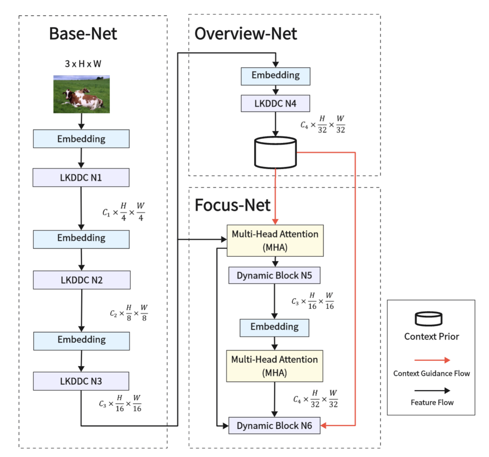
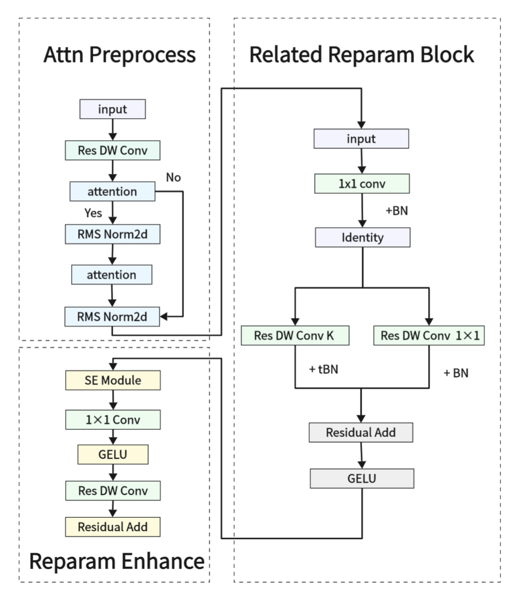
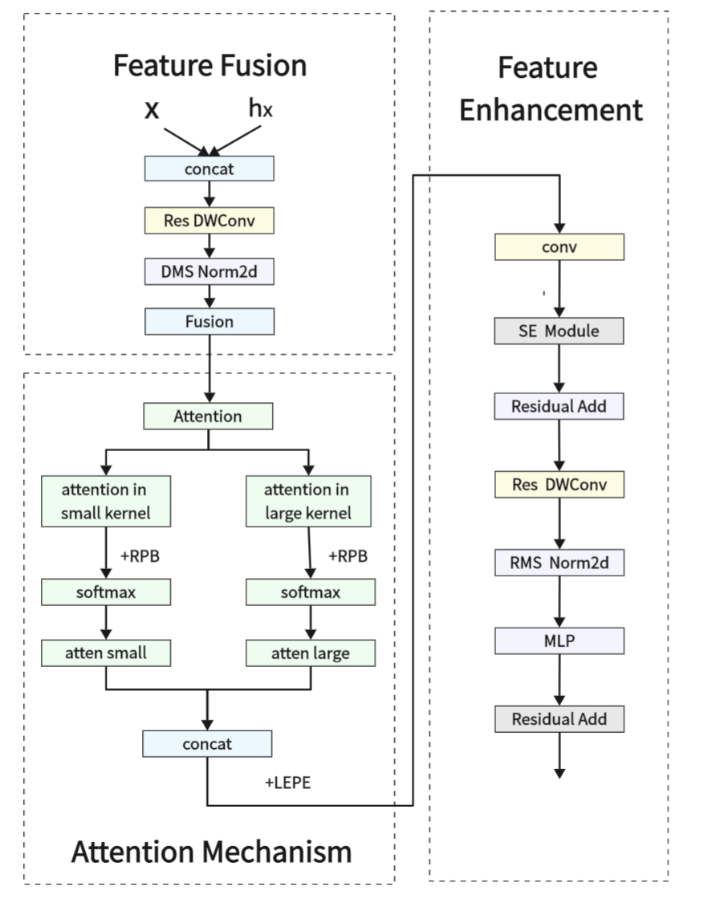

<<<<<<< HEAD
# DRTNet: Dilated Re-parameterization and Compact Calibration for Efficient Object Detection

This is an official PyTorch implementation of "[**DRTNet: Dilated Re-parameterization and Compact Calibration for Efficient Object Detection**](https://)".

# Introduction
The design of general object detection backbones is often limited by the trade-off between performance gains and computational complexity, which are tightly coupled. Such coupling leads to operator fragmentation, restricts deployment efficiency, and occasionally causes severe gradient vanishing. In this paper, we introduce a unified framework for backbone reconstruction and optimization, based on the principles of feature transformation equivalence and structural inductive bias. Building upon GRN and LayerScale, we design a convolution-friendly normalization to construct a smooth and compact channel re-calibration mechanism. As an alternative to traditional SE blocks, this method successfully avoids excessive dependency on global context while enhancing generalization stability. Crucially, we propose the Dilated Re-parameterization Block, which integrates re-parameterized large-kernel convolutions with block-wise self-attention to seamlessly combine local inductive biases with long-range dependency modeling. Empirical results reveal that our method effectively resolves the efficiency bottlenecks of high-frequency computational operations. It significantly reduces memory access costs and computational overhead, yielding substantial improvements in both detection accuracy and edge-side deployment efficiency.
<div align="center">
  
  
  
</div>


# Notes
It's baseline website: [OverLoCK](https://github.com/LMMMEng/OverLoCK).
We don't change the name in model, now the RepBlock means LKDDC, OverLoCK means DRTNet, We do some optimazation to make it run quickly and enhance about one point in map and 6 point in bap, but our work has one important bad thing: Detecting edge discontinuities in complex scenarios. It's our main difficulty, our future work will focus on small-scale targets and complex scene recognition.

## 1. Requirements
# Environments:
cuda==12.1
python==3.10
# Dependencies:
pip install torch==2.3.1 torchvision==0.18.1 --index-url https://download.pytorch.org/whl/cu121
pip install natten==0.17.1+torch230cu121 -f https://shi-labs.com/natten/wheels/
pip install timm==0.6.12
pip install mmengine==0.2.0


## 2. Data Preparation
Prepare [ImageNet](https://image-net.org/) with the following folder structure, you can extract ImageNet by this [script](https://gist.github.com/BIGBALLON/8a71d225eff18d88e469e6ea9b39cef4).

```
│imagenet/
├──train/
│  ├── n01440764
│  │   ├── n01440764_10026.JPEG
│  │   ├── n01440764_10027.JPEG
│  │   ├── ......
│  ├── ......
├──val/
│  ├── n01440764
│  │   ├── ILSVRC2012_val_00000293.JPEG
│  │   ├── ILSVRC2012_val_00002138.JPEG
│  │   ├── ......
│  ├── ......
```

## 3.Main Results on Coco2017
\label{tab:ablation_modules}
\begin{tabularx}{\linewidth}{Xccccccc}
\toprule
Variant & DWConv & SEModule & RMSNorm2d & Multi-Head & Total time & $AP^b$ & $AP^m$ \\
 & Reparam & Hardsigmoid+Mean & & Attention \\
\midrule
Baseline (OverLoCK-T) & -- & Sigmoid+AvgPool & LayerNorm2d & -- & 4d 1h 42m 4s & 48.3 & 43.3 \\
+ DWConv Reparam & \checkmark & Sigmoid+AvgPool & LayerNorm2d & -- & 2d 14h 52m 49s & 38.75 & 35.07 \\
+ SEModule Hardsigmoid & \checkmark & \checkmark & LayerNorm2d & -- & 2d 14h 23m 12s & 38.59 & 35.31 \\
+ RMSNorm2d & \checkmark & \checkmark & \checkmark & -- & 2d 13h 32m 41s & 37.60 & 34.50 \\
+ Multi-Head Attention & -- & Sigmoid+AvgPool & LayerNorm2d & 2 & 4d 11h 50m 38s & 48.65 & 43.38 \\
\midrule
DRTNet & \checkmark & \checkmark & \checkmark & 2 & 2d 14h 24m 58s & 49.46 & 50.17 \\
\bottomrule
\end{tabularx}
\label{tab:ablation_modules}
\end{table*}

## 4. Pretrained pth on ImageNet-1K with Pretrained Models by [OverLoCK](https://github.com/LMMMEng/OverLoCK)

| Models      | Input Size | FLOPs (G) | Params (M) | Top-1 (%) | Download |
|:-----------:|:----------:|:---------:|:----------:|:----------:|:----------:|
| OverLoCK-XT | 224x224    | 2.6       | 16       | 82.7       | [model](https://github.com/LMMMEng/OverLoCK/releases/download/v1/overlock_xt_in1k_224.pth)     |
| OverLoCK-T | 224x224    | 5.5       | 33      | 84.2       | [model](https://github.com/LMMMEng/OverLoCK/releases/download/v1/overlock_t_in1k_224.pth)     |
| OverLoCK-S | 224x224    | 9.7      | 56       | 84.8       | [model](https://github.com/LMMMEng/OverLoCK/releases/download/v1/overlock_s_in1k_224.pth)     |
| OverLoCK-B | 224x224    | 16.7       | 95       | 85.1       | [model](https://github.com/LMMMEng/OverLoCK/releases/download/v1/overlock_b_in1k_224.pth)     |

## 5. Train
To train ```OverLoCK``` models on ImageNet-1K with 8 gpus (single node), run:
```
bash scripts/train_xt_model.sh # train OverLoCK-XT
bash scripts/train_t_model.sh  # train OverLoCK-T
bash scripts/train_s_model.sh  # train OverLoCK-S
bash scripts/train_b_model.sh  # train OverLoCK-B
```  
> 💡If you encounter NaN loss, please delete ``--native-amp`` to disable AMP training and resume the checkpoint before the NaN loss occurred.
>   
> 💡If your **GPU memory** is insufficient during training, you can enable gradient checkpointing by adding the following arguments: ``--grad-checkpoint --ckpt-stg 4 0 0 0``. If you're still experiencing memory issues, you can increase these values, but be aware that this may slow down training speed.

## 6. Validation
To Visualize detection, run plot2.py in the folder named detection.


To evaluate ```OverLoCK``` on ImageNet-1K, run:
```
MODEL=overlock_xt # overlock_{xt, t, s, b}
python3 validate.py \
/path/to/imagenet \
--model $MODEL -b 128 \
--pretrained # or --checkpoint /path/to/checkpoint 
```

# Citation


# Dense Predictions
[Object Detection](detection)  
[Semantic Segmentation](segmentation)   

# Acknowledgment
Our implementation is mainly based on the following codebases. We gratefully thank the authors for their wonderful works.  
> [timm](https://github.com/rwightman/pytorch-image-models), [natten](https://github.com/SHI-Labs/NATTEN), [mmcv](https://github.com/open-mmlab/mmcv), [mmdet](https://github.com/open-mmlab/mmdetection), [mmseg](https://github.com/open-mmlab/mmsegmentation), [OverLoCK](https://github.com/LMMMEng/OverLoCK)

# Contact
If you have any questions, welcome to [create issues❓](https://github.com/WuBai2005/DRTNet/issues) or talk in (https://github.com/LMMMEng/OverLoCK/issues)
=======
# DRTNet
Optimization Model of OverLoCK
>>>>>>> e9bcd3029b0c2071c9564ad817330a27558e81e4
